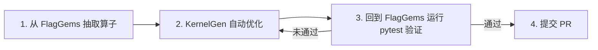
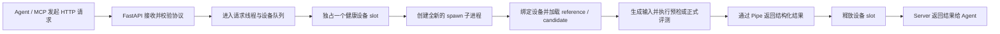
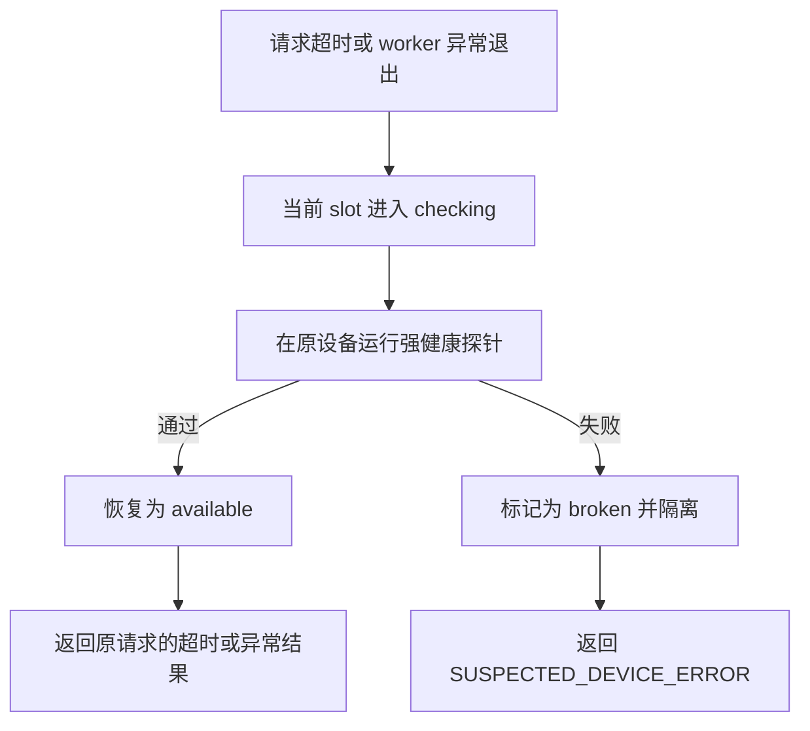

# KernelGen 当前方案汇报

## 1. 方案概述

KernelGen 用 AI Agent 自动生成和优化 GPU/NPU Kernel，并在真实目标设备上完成编译、
正确性验证和性能评测。我们的目标是把算子从测试用例抽取、Kernel 优化、上游验证到
提交 PR 串成一条可追溯的流程。

当前整体流程可以概括为四步：



其中，算子抽取、自动优化和 KernelGen Server 评测已经构成主要工作链路；通过
FlagGems 原生测试后自动提交 PR 是后续希望完整打通的环节，目前尚未作为正式自动化
交付流程使用。

## 2. 当前端到端流程

### 2.1 从 FlagGems 抽取算子

抽取阶段读取 FlagGems 中已有的算子实现、pytest 和 benchmark，将其整理成
KernelGen 可以执行的统一描述：

- **Definition**：算子的接口、reference 实现和正确性判定方式；
- **Workload**：测试使用的 shape、dtype、参数、随机种子和误差容限；
- **正确性用例**：尽量复现 FlagGems pytest 的输入与断言语义；
- **性能用例**：来自 FlagGems benchmark，作为后续优化和性能比较的场景。

抽取不是只复制一个同名 API，而是要保留 pytest 中的实际调用方式、边界条件、数据
类型、原地修改、特殊输入和比较规则。抽取结果先用 reference 作为 candidate 运行
一次，确认 Definition 和 Workload 本身可执行，再进入优化。

### 2.2 KernelGen 自动优化

KernelGen Agent 读取算子定义和目标设备信息，分析算子特点并生成候选 Kernel。每轮
候选都要经过以下流程：

1. 生成或修改候选代码；
2. 通过 KernelGen Server 做编译预检；
3. 预检通过后，在全部约定 Workload 上做正确性和性能评测；
4. 将结果写入 ledger，由程序选择当前最佳实现并决定继续优化或停止；
5. 必要时采集 profiler 数据，辅助下一轮优化。

单个算子可以连续优化多轮，多个算子也可以并行生成。Agent 负责分析和写代码，但不能
自行声明候选正确或性能更快；正式结论只使用 Server 在目标设备上的评测结果。

### 2.3 回到 FlagGems 运行 pytest

Server 验证通过后，将最优 Kernel 接入对应的 FlagGems 厂商后端，并运行 FlagGems
原生 pytest。这个阶段验证的不只是 Kernel 数值，还包括：

- 算子注册、导出和 dispatch 是否正确；
- 新实现是否保持原有接口和测试语义；
- 是否影响同一模块或相关算子的已有测试；
- KernelGen 抽取的验证契约是否与 FlagGems 实际验收口径一致。

KernelGen Server 评测解决的是“候选在统一契约和目标设备上是否正确、性能如何”；
FlagGems pytest 解决的是“候选接入真实工程后是否可以交付”。两层验证都通过，才能
进入提交阶段。

### 2.4 提交 PR

通过测试的实现应整理代码、测试结果、目标设备和性能数据，然后向 FlagGems 提交
PR。仓库中已有面向该方向的 PR Workflow，但当前还没有把它作为正式自动化流程完整
跑通，因此现阶段仍以“产出可提交的最优 Kernel 和完整验证证据”为主要结果。

## 3. KernelGen Server 的作用

KernelGen Server 是整套方案中的目标设备执行边界。Agent 可以运行在本地开发机，
Server 则运行在安装了厂商 PyTorch、Triton 和运行时的目标机器上。

它主要承担四项职责：

1. 接收统一的算子定义、Workload 和候选源码；
2. 在真实目标设备上完成编译、正确性验证、计时和 profiler；
3. 对设备进行独占调度、请求隔离和故障恢复；
4. 返回结构化结果，供 KernelGen 记录、比较和决定下一轮优化。

不同芯片的设备发现、设备选择、同步和计时差异由 Server 的 backend adapter 处理。
Agent 面对的是统一协议，不需要直接适配每一家厂商运行时。

## 4. Server 如何处理请求

Server 对评测请求的处理链路如下：



主要请求类型如下：

| 请求 | 用途 | 处理结果 |
|---|---|---|
| `/status` | 查询 Server、目标设备、计时方式和调度状态 | 返回环境与每个设备 slot 的状态 |
| `/preflight` | 对候选做静态策略、编译和冒烟执行检查 | 通过后才允许进入正式评测 |
| `/evaluate` | 执行 reference 和 candidate，比较正确性并计时 | 返回逐 Workload 结果和总体结论 |
| `/profile` | 对指定候选和 Workload 采集厂商 profiler 证据 | 返回指标和可下载的产物 |
| Debug Job | 在目标设备上执行临时诊断脚本 | 返回执行状态、输出和诊断产物 |

正式评测时，Server 会设置随机种子并生成 Workload 输入，分别为 reference 和
candidate 准备调用数据，检查输出结构、dtype、shape 和数值误差。全部正确性用例
通过后才发布总体性能指标，避免只统计成功用例而产生误导。

## 5. Server 的隔离机制

### 5.1 设备独占隔离

Server 为每张可见设备只创建一个设备 slot，也就是一个独占 token。Eval、Profile
和 Debug Job 都必须先取得 token 才能使用设备：

- 同一时刻，一张卡最多运行一个设备任务；
- 设备全部占用时，后续请求在 Server 内排队；
- `max_workers` 只控制 Server 可以承载的请求线程数，不会复制设备 token；
- 因此 Agent 并发可以大于设备数，但不会出现多个评测任务同时污染同一张卡。

这项隔离既避免显存和运行时冲突，也保证性能计时不会受到同卡并发任务干扰。

### 5.2 进程隔离

每个 `/preflight` 或 `/evaluate` 请求都在一个全新的非 daemon `spawn` 子进程中执行。
子进程负责加载候选代码、初始化设备上下文、执行 Workload 并返回结果；请求结束后该
进程退出。

这样可以把候选代码导入、设备上下文、显存泄漏和普通进程崩溃与常驻 HTTP 进程隔离
开。请求超时后，Server 先终止该子进程；普通终止无效时再强制结束。使用非 daemon
进程是因为部分厂商 profiler 和运行时还需要继续创建子进程。

需要说明的是，这属于故障和生命周期隔离，不是权限安全沙箱。候选代码仍拥有 Server
账号的系统权限，所以 Server 只接受可信客户端，Debug Server 也只绑定 loopback，
远端访问通过 SSH stdio HTTP proxy 完成。

### 5.3 设备健康隔离

Server 启动时会并行检查所有可见设备，执行矩阵乘、softmax、同步和目标计时链路。
只有通过强探针的设备才进入调度队列；部分设备失败时，Server 可以用剩余健康设备以
`degraded` 状态运行，全部失败则拒绝启动。

运行过程中，如果请求超时或隔离子进程异常退出，当前设备 slot 会先进入
`checking`，暂停接收新请求，然后在同一张卡上用全新进程重新执行强探针：



Server 不会把同一个异常请求自动转发到另一张卡，以免一个可能污染运行时的请求继续
影响其他设备。普通算子 `RUNTIME_ERROR` 只表示代码或 API 执行失败，不会触发设备
强探针。所有 slot 都变为 `broken` 后，新请求直接返回 HTTP 503，等待人工恢复设备
运行时和 Server。

### 5.4 可观测状态

`/status.scheduler` 对外提供设备总数、健康数、检查中和损坏的 slot 数，以及当前
执行数、等待数、空闲数和历史 incident。正常空闲状态应满足：

```text
active=0
waiting=0
checking=0
broken=0
available=device_slots
```

这些信息让我们能够区分三类情况：Agent 并发较高导致的正常排队、候选 Kernel 自身
执行失败，以及设备或厂商运行时已经异常。

## 6. 当前验证口径

- `PASSED` 表示全部 Workload 数值正确并取得有效计时，不代表一定比 reference 快；
- 性能结果由独立的加速比指标判断，不能把流程通过直接写成性能提升；
- 多轮后仍未通过通常表示优化未收敛；零轮失败优先检查算子抽取、协议、reference、
  编译或芯片能力；
- 最终交付还要经过 FlagGems 原生 pytest，确认实现能够正确接入上游工程；
- 完整结果保留候选代码、逐轮 ledger、最佳 Kernel、Server 返回和测试记录，保证问题
  可以复现和追溯。

更详细的项目入口见 [项目上手指南](../../ONBOARDING.md)，Server 设计见
[KernelGen Server 设计](../../../../kernelgen_server/docs/DESIGN.md)。
